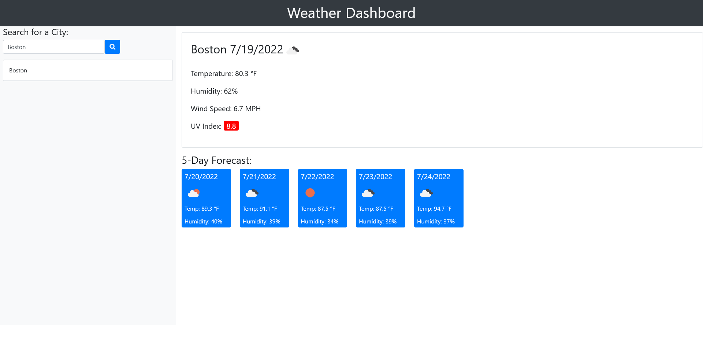

## Weather Dashboard

# Assignment Checklist

- [ x ] WHEN I search for a city, THEN I am presented with current and future conditions for that city and that city is added to the search history
- [ x ] WHEN I view current weather conditions for that city, THEN I am presented with the city name, the date, an icon representation of weather conditions, the temperature, the humidity, the wind speed, and the UV index
- [ x ] WHEN I view the UV index, THEN I am presented with a color that indicates whether the conditions are favorable, moderate, or severe
- [ x ] WHEN I view future weather conditions for that city, THEN I am presented with a 5-day forecast that displays the date, an icon representation of weather conditions, the temperature, the wind speed, and the humidity
- [ x ] WHEN I click on a city in the search history, THEN I am again presented with current and future conditions for that city

# Screenshot of live URL

# Links

## Github Repository

https://github.com/Garendemirdogen/ubiquitous-fortnight.git

## Live URL

https://garendemirdogen.github.io/ubiquitous-fortnight/

Created by Garen Demirdogen. 2022
